<div align="center">


### Software Developer · Full Stack Developer · B.E. CSE Graduate

Building practical web applications and AI-driven systems with the MERN stack, Python, and computer vision.

[](https://www.linkedin.com/in/santhiya94)
[](https://santhiya-portflio.netlify.app/)
[](mailto:santhiya9704@gmail.com)

</div>

<br>

## About Me

<table>
<tr>
<td valign="top" width="55%">

**B.E. Computer Science & Engineering graduate** who builds full-stack applications end to end — from REST APIs and database schemas to React interfaces.

- Full-stack development with **Python, JavaScript, React, Node.js, SQL**
- Building cross-platform apps with **Flutter**
- Extending applications with **AI / computer vision** where it adds real value
- Enjoy shipping real-world applications and picking up new tools as needed

</td>
<td valign="top" width="45%" align="center">

</td>
</tr>
</table>

<br>

## Tech Stack

<table>
<tr>
<td align="center" width="96">
<br><sub>Python</sub>
</td>
<td align="center" width="96">
<br><sub>JavaScript</sub>
</td>
<td align="center" width="96">
<br><sub>C</sub>
</td>
<td align="center" width="96">
<br><sub>HTML5</sub>
</td>
<td align="center" width="96">
<br><sub>CSS3</sub>
</td>
<td align="center" width="96">
<br><sub>React</sub>
</td>
</tr>
<tr>
<td align="center" width="96">
<br><sub>Node.js</sub>
</td>
<td align="center" width="96">
<br><sub>Express</sub>
</td>
<td align="center" width="96">
<br><sub>MongoDB</sub>
</td>
<td align="center" width="96">
<br><sub>MySQL</sub>
</td>
<td align="center" width="96">
<br><sub>Flutter</sub>
</td>
<td align="center" width="96">
<br><sub>Dart</sub>
</td>
</tr>
<tr>
<td align="center" width="96">
<br><sub>OpenCV</sub>
</td>
<td align="center" width="96">
<br><sub>Git</sub>
</td>
<td align="center" width="96">
<br><sub>GitHub</sub>
</td>
<td align="center" width="96">
<br><sub>Postman</sub>
</td>
<td align="center" width="96">
<br><sub>VS Code</sub>
</td>
</tr>
</table>

<br>

## Engineering Focus

- Full-stack development (React + Node/Express + MongoDB)
- REST API design and CRUD systems
- Authentication and role-based access
- Responsive UI implementation
- AI / computer vision (object detection, face verification & liveness)
- Debugging and testing across frontend/backend boundaries
- Git-based collaborative development
- Data structures & algorithms / problem solving

<br>

## Featured Projects

<div align="center">

</div>

<br>

<table>
<tr>
<td valign="top" width="50%">

#### 🛒 GadgetHub
**E-Commerce Web Application**


*A full-stack e-commerce platform built and validated against defined functional requirements.*

> **My contribution**
> Designed and integrated REST APIs with MongoDB · Built product search/filtering, wishlist, cart, and comparison modules · Validated UI/UX consistency across devices


[](https://github.com/santhiya974/gadgethub)
[](https://gadgethub-tech-gadget.netlify.app/)

</td>
<td valign="top" width="50%">

#### 🚗 Driver Drowsiness Detection
**Real-Time Fatigue Monitoring**


*A real-time fatigue-monitoring system that analyzes eye movement to flag driver drowsiness.*

> **My contribution**
> Built and validated the detection pipeline · Tested accuracy across varied lighting/video conditions · Refined the model to reduce false positives


[](https://github.com/santhiya974/driver-drownsiness-detection)

</td>
</tr>
<tr>
<td valign="top" width="50%">

#### 🦁 Wild Animal Intrusion Detection
**Real-Time Alert System**


*A real-time detection system that flags wild-animal intrusions into restricted areas from live video streams.*

> **My contribution**
> Integrated YOLOv8 and CNN-based detection · Added automated email/audio alerts · Validated performance across multiple real-world test scenarios


[](https://github.com/santhiya974/wild-animal-intrusion-detection)

</td>
<td valign="top" width="50%">

#### 🔐 TheyDi
**Face Verification & Liveness Module**


*A Flutter-based social gathering app for the Indian market.*

> ⚠️ **I did not build the full application.** My contribution was specifically the face verification module.

> **My contribution**
> Camera-based face verification, liveness detection, and selfie capture · Fixed ML Kit bounding-box normalization for sensor orientation · Handled front-camera mirroring issues


</td>
</tr>
<tr>
<td colspan="2" valign="top" align="center">

#### 🧬 Breast Cancer Classification
**Image Classification & Dimensionality Reduction**

 

*An image classification project exploring dimensionality reduction and classical ML models for early cancer detection screening.*

> **My contribution**
> Built the preprocessing pipeline with PCA · Trained and evaluated SVM and Random Forest classifiers


[](YOUR_LINK_HERE) — *replace with your Colab/GitHub link*

</td>
</tr>
</table>

<br>

## Experience

**Full Stack Development Intern** — Ulertz Learning Solutions Pvt. Ltd. · *June 2025 – July 2025*
Built and validated full-stack web applications (React.js, Node.js, Express.js, MongoDB), integrated and tested REST APIs for CRUD operations, and collaborated via Git/GitHub on code review and documentation.

**Software Development Intern** — Vrutsa Solutions · *August 2026 – Present*
Working on the face verification module of a mobile application — implementing and enhancing camera-based face detection, liveness verification, and selfie capture, and debugging verification/camera issues.

<br>

## Currently Improving

- Advanced Python
- MERN stack depth (auth, scalability, testing)
- Data Structures & Algorithms
- Software engineering practices

<br>

## Workflow

```
Build → Debug → Test → Refactor → Improve
```

<br>

## GitHub Analytics

<div align="center">

[](https://github.com/santhiya974?tab=followers)
[](https://github.com/santhiya974?tab=repositories)

Full contribution activity is shown automatically on the [GitHub profile page](https://github.com/santhiya974) itself, right below this README.

</div>

<br>

## My Contribution Graph

<!-- pacman -->
<picture>
    <source media="(prefers-color-scheme: dark)" srcset="https://raw.githubusercontent.com/santhiya974/santhiya974/output/pacman-contribution-graph-dark.svg">
    <source media="(prefers-color-scheme: light)" srcset="https://raw.githubusercontent.com/santhiya974/santhiya974/output/pacman-contribution-graph.svg">
    
</picture>

*Renders after the workflow in `.github/workflows/main.yml` runs once — see setup steps below.*

<br>

## Let's Connect

[](https://www.linkedin.com/in/santhiya94)
[](https://santhiya-portflio.netlify.app/)
[](mailto:santhiya9704@gmail.com)
