<div align="center">



### Software Developer · Full Stack Developer · B.E. CSE Graduate

Building practical web applications and AI-driven systems with the MERN stack, Python, and computer vision.

[](https://www.linkedin.com/in/santhiya94)
[](https://santhiya-portflio.netlify.app/)
[](mailto:santhiya9704@gmail.com)

</div>

<br>

## About

I'm a Computer Science Engineering graduate who builds full-stack applications end to end — from REST APIs and database schemas to React interfaces — and extends them with AI/computer-vision components where they add real value. My work spans e-commerce platforms, real-time detection systems using YOLO/OpenCV, and face verification pipelines for mobile apps. I care about writing code that's debugged and tested properly, not just code that runs once.

<br>

## Tech Stack

**Languages**


**Frontend**


**Backend**


**Database**


**Mobile**


**AI / Computer Vision**


**Tools**


<br>

## Engineering Focus

- Full-stack development (React + Node/Express + MongoDB)
- REST API design and CRUD systems
- Authentication and role-based access
- Responsive UI implementation
- AI / computer vision (object detection, face verification & liveness)
- Debugging and testing across frontend/backend boundaries
- Git-based collaborative development
- Data structures & algorithms / problem solving

<br>

## Featured Projects

### 🛒 [GadgetHub — E-Commerce Web Application](https://github.com/santhiya974/gadgethub)
A full-stack e-commerce platform built and validated against defined functional requirements.
- **My contribution:** designed and integrated REST APIs with MongoDB, built product search/filtering, wishlist, cart, and comparison modules, and validated UI/UX consistency across devices
- **Stack:** React.js · Node.js · Express.js · MongoDB
- 🔗 [Live Demo](https://gadgethub-tech-gadget.netlify.app/)

### 🚗 [Driver Drowsiness Detection System](https://github.com/santhiya974/driver-drownsiness-detection)
A real-time fatigue-monitoring system that analyzes eye movement to flag driver drowsiness.
- **My contribution:** built and validated the detection pipeline, tested accuracy across varied lighting/video conditions, and refined the model to reduce false positives
- **Stack:** Python · OpenCV · Computer Vision

### 🦁 [Wild Animal Intrusion Detection](https://github.com/santhiya974/wild-animal-intrusion-detection)
A real-time detection system that flags wild-animal intrusions into restricted areas from live video streams.
- **My contribution:** integrated YOLOv8 and CNN-based detection, added automated email/audio alerts, and validated performance across multiple real-world test scenarios
- **Stack:** Python · YOLOv8 · CNN · OpenCV

### 🔐 TheyDi — Face Verification & Liveness Module
A Flutter-based social gathering app for the Indian market. **I did not build the full application** — my contribution is specifically the face verification module.
- **My contribution:** camera-based face verification, liveness detection, and selfie capture; fixed ML Kit bounding-box normalization for sensor orientation and front-camera mirroring
- **Stack:** Flutter · Dart · Google ML Kit

### 🧬 Breast Cancer Classification (Academic Project)
An image classification project exploring dimensionality reduction and classical ML models for early cancer detection screening.
- **My contribution:** built the preprocessing pipeline with PCA and trained/evaluated SVM and Random Forest classifiers
- **Stack:** Python · scikit-learn · PCA
- 🔗 [Notebook](YOUR_LINK_HERE) — *replace with your Colab/GitHub link*

<br>

## Experience

**Full Stack Development Intern** — Ulertz Learning Solutions Pvt. Ltd. · *June 2025 – July 2025*
Built and validated full-stack web applications (React.js, Node.js, Express.js, MongoDB), integrated and tested REST APIs for CRUD operations, and collaborated via Git/GitHub on code review and documentation.

**Software Development Intern** — Vrutsa Solutions · *August 2026 – Present*
Working on the face verification module of a mobile application — implementing and enhancing camera-based face detection, liveness verification, and selfie capture, and debugging verification/camera issues.

<br>

## Currently Improving

- Advanced Python
- MERN stack depth (auth, scalability, testing)
- Data Structures & Algorithms
- Software engineering practices

<br>

## Workflow

```
Build → Debug → Test → Refactor → Improve
```

<br>

## GitHub Analytics

<div align="center">


</div>

<br>

## My Contribution Graph

<!-- pacman -->
<picture>
    <source media="(prefers-color-scheme: dark)" srcset="https://raw.githubusercontent.com/santhiya974/santhiya974/output/pacman-contribution-graph-dark.svg">
    <source media="(prefers-color-scheme: light)" srcset="https://raw.githubusercontent.com/santhiya974/santhiya974/output/pacman-contribution-graph.svg">
    
</picture>

*Renders after the workflow in `.github/workflows/main.yml` runs once — see setup steps below.*

<br>

## Let's Connect

[](https://www.linkedin.com/in/santhiya94)
[](https://santhiya-portflio.netlify.app/)
[](mailto:santhiya9704@gmail.com)

